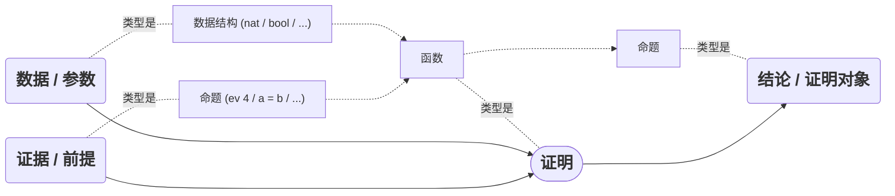

# [The]{.op80} [Coq]{.font-mono} [Proof Assistant]{.op80}

计算机辅助证明简介{.!op90.text-2xl.pt-4}

<div absolute font-mono right-10 bottom-4>

\_Kerman @ USTC Solvay

</div>

---
class: pt-6
---

# Preface {.!text-2xl.!mb-0}

## The [Coq]{.font-mono} Proof Assistant


<div class="!children:list-circle text-xl my-2">

- 形式化
- 交互式

</div>

<div scale-90 w-240 style="transform-origin:left top">

```coq editor
Theorem add_0_r : forall n:nat, n + 0 = n.
Proof.
  intros n. induction n as [| n' IHn'].
  - reflexivity.
  - simpl. rewrite -> IHn'. reflexivity.
Qed.

Theorem add_comm : forall n m : nat,
  n + m = m + n.
Proof.
  induction n as [| n' IHn'].
  - simpl. intro m.
    rewrite add_0_r. reflexivity.
  - simpl. intro m.
    rewrite IHn'. induction m as [| m' IHm'].
      + reflexivity.
      + simpl. rewrite IHm'. reflexivity.
Qed.
```

</div>

---

# Preface {.!text-2xl.!mb-0}

## 用途

<v-clicks mt-6 text-xl at="+0">

- 证明数学定理
  <span absolute left-135 text-gray> <carbon-arrow-right /> 四色定理、开普勒猜想…… </span>
  - 需要大量计算的定理
  - 没有歧义的形式化数学证明
- 证明软件的正确性
  - 验证编译器的优化是否不改变程序的行为
    <span absolute left-135 text-gray> <carbon-arrow-right /> CompCert: 完全验证的 C 优化编译器 </span>
  - 验证算法的正确性
    <span absolute left-135 text-gray> <carbon-arrow-right /> CertiCrypt: 论证密码学算法安全性 </span>
- ...

</v-clicks>

---
layout: image-right
image: https://upload.wikimedia.org/wikipedia/commons/thumb/8/8a/Four_Colour_Map_Example.svg/375px-Four_Colour_Map_Example.svg.png
---

# Preface {.!text-2xl.!mb-0}

## 四色定理的证明

<v-clicks mt-10>

- 1976 年，借助计算机验证了“1936个构形都是可约构形”的结论，从而证明了四色定理

- 2004 年，Georges Gonthier 使用 Coq **可靠地**证明了该结论
  <div font-mono text-blue-300 w-100>
  <carbon-cursor-1 /> github.com/coq-community/fourcolor
  </div>

</v-clicks>

<v-click>

穷举法？ {.text-3xl.p-7}

</v-click>

<v-click>

不仅仅是！ {.text-3xl.px-7}

</v-click>

---

# Preface {.!text-2xl.!mb-0}

## 涉及内容 {.!text-4xl}

<div absolute left-40 top-25>
  <div
    v-click
    absolute w-120 h-120 left-0 top--10 border="~ blue rounded-full"
    bg-blue:20 text-3xl text-blue flex="~ items-center justify-center"
  >
    形式化证明
  </div>
  <div
    v-click
    absolute w-90 h-90 left-80 top--40 border="~ green rounded-full"
    bg-green:20 text-3xl text-green flex="~ items-center justify-center"
  >
    函数式编程
  </div>
  <div
    v-click
    absolute w-100 h-100 left-85 top-25 border="~ amber rounded-full"
    bg-amber:20 text-3xl text-amber flex="~ items-center justify-center"
  >
    类型理论
  </div>
</div>

---

# 从枚举类型开始

看起来用处不大？

```coq {*}{class:'!children:text-lg'}
Inductive day : Type :=
  | monday
  | tuesday
  | wednesday
  | thursday
  | friday
  | saturday
  | sunday.
```

<div h-2 />

<span v-click text-xl v-mark.red.cross>Enumerate: 枚举?</span>

<div v-click text-xl>

**Inductive**: 归纳!

</div>

---

# 从枚举类型开始

函数 / 映射 / “定义” {.!op100}

<div relative flex flex-cols gap-6>

```cpp {*}{class:'!children:text-[16px]'}
// C++
day next_day(day d) {
  switch (d) {
    case monday: return tuesday;
    case tuesday: return wednesday;
    case wednesday: return thursday;
    case thursday: return friday;
    case friday: return monday;
    case saturday: return monday;
    case sunday: return monday;
  }
}
```

```coq {*}{class:'!children:text-[16px] !children:h-full'}
(* Coq *)
Definition next_weekday (d: day) : day :=
  match d with
  | monday ⇒ tuesday
  | tuesday ⇒ wednesday
  | wednesday ⇒ thursday
  | thursday ⇒ friday
  | friday ⇒ monday
  | saturday ⇒ monday
  | sunday ⇒ monday
  end.
```

</div>

---

# 从枚举类型开始

从枚举开始的数据表示法：布尔值

```coq {*}{class:'!children:text-[18px]'}
Inductive bool : Type :=
  | true
  | false.
```

<div mt-2 grid grid-cols-3 gap-3>

```coq {*}{class:'!children:text-[16px]'}
Definition negb
    (b:bool) : bool :=
  match b with
  | true ⇒ false
  | false ⇒ true
  end.
```

```coq {*}{class:'!children:text-[16px]'}
Definition andb
    (b1 b2:bool) : bool :=
  match b1 with
  | true ⇒ b2
  | false ⇒ false
  end.
```

```coq {*}{class:'!children:text-[16px]'}
Definition orb
    (b1 b2:bool) : bool :=
  match b1 with
  | true ⇒ true
  | false ⇒ b2
  end.
```

</div>

---

# 从枚举类型开始

从枚举开始的数据表示法：自然数，基于皮亚诺公理

```coq {*}{class:'!children:text-[16px]'}
Inductive nat : Type :=
  | O             (* 0 *)
  | S (n : nat).  (* n 的后继(Successor) *)
```

<v-click>
<div>

| 十进制 | as `nat`      |
| ------ | ------------- |
| 0      | `O`           |
| 1      | `S O`         |
| 2      | `S (S O)`     |
| 3      | `S (S (S O))` |

</div>
</v-click>

<div v-click class="text-3xl -mt-4 ml-10 font-serif -rotate-7">
一进制 ？？？
</div>

---

#### succ 的反操作：pred

```coq
Definition pred (n : nat) : nat :=
  match n with
  | O ⇒ O
  | S n' ⇒ n'
  end.
```

<div v-click class="text-xl mt-10">

如何判断奇偶性？

$\text{even:} \space \space \mathbb{N} \to \mathbb{B}$

</div>

---

# 递归函数

函数式编程的特征之一

#### even

```coq
Fixpoint even (n:nat) : bool :=
  match n with
  | O ⇒ true
  | S O ⇒ false
  | S (S n') ⇒ even n'
  end.
```

#### odd

```coq
Definition odd (n:nat) : bool :=
  negb (even n).
```

---

# 递归函数

更多的例子

#### plus

```coq
Fixpoint plus (n : nat) (m : nat) : nat :=
  match n with
  | O ⇒ m
  | S n' ⇒ S (plus n' m)
  end.
```

<div h-3 />

#### mult

```coq
Fixpoint mult (n m : nat) : nat :=
  match n with
  | O ⇒ O
  | S n' ⇒ plus m (mult n' m)
  end.
```

---

# 好了，开始证吧！

从显然的命题开始

<!-- Should be interactive -->

$$
\forall n \in \N, \space 0 + n = n
$$

```coq
Theorem plus_O_n : ∀ n : nat, 0 + n = n.
```

```coq {hide|all}
Proof.
  intros n.
  simpl.
  reflexivity.
Qed.
```

<div v-click pt-2>

_simpl_ [简化表达式]{.op80}: $0 + n$ 由 $\text{plus}$ 的定义，化简为 $n$

_reflexivity_ [自反性]{.op80}: $a = a$ 必然成立

</div>

---

# 通过改写证明

The `rewrite` tactic

$$
\forall n \in \N, \space n = m \Rightarrow n + n = m + m
$$

<div v-if="$clicks < 1">

```coq
Theorem plus_id_example : ∀ n m:nat,
  n = m →
  n + n = m + m.
```

</div>

<div v-click>

```coq editor
Theorem plus_id_example : ∀ n m:nat,
  n = m →
  n + n = m + m.
Proof.
  intros n m.
  intros H.
  rewrite → H. (* !!! *)
  reflexivity.
Qed.
```

</div>

<div v-click text-2xl pt-3 pl-5>
变量代换？
</div>

---

# ???

又一个“显然”的命题

$$
\forall n \in \N, \space n + 1 \neq 0
$$

```coq
Theorem plus_1_neq_0 : ∀ n : nat,
  (n + 1) =? 0 = false.
```

<span op80>$\text{eqb}$ 的定义：</span>

```coq
Fixpoint eqb (n m : nat) : bool :=
  match n with
  | O ⇒ match m with
         | O ⇒ true
         | S m' ⇒ false
         end
  | S n' ⇒ match m with
            | O ⇒ false
            | S m' ⇒ eqb n' m'
            end
  end.
```

---

# 分类讨论

The `destruct` tactic

直接通过 `simpl` 化简？并不能 😭

```coq editor
Theorem plus_1_neq_0 : ∀ n : nat,
  (n + 1) =? 0 = false.
Proof.
  intros n.
  simpl. simpl. simpl. simpl. simpl.
Abort.
```

<v-click>

原因：$\text{add}$ 与 $\text{eqb}$ 都通过 $\text{match}$ 语句定义。而由于 `n` 是 `O` 还是 `S n'` 是未知的，所以无法直接化简。

</v-click>

---

# 分类讨论

<div/>

使用 `destruct` 策略：

```coq editor
Theorem plus_1_neq_0 : ∀ n : nat,
  (n + 1) =? 0 = false.
Proof.
  intros n.
  destruct n as [| n'] eqn:E.
  - (* E: n = O *)
    reflexivity.
  - (* E: n = S n' *)
    reflexivity.
Qed.
```

---

# ???

<div/>

加法也分左右？

```coq
Fixpoint plus (n : nat) (m : nat) : nat :=
  match n with
  | O ⇒ m
  | S n' ⇒ S (plus n' m)
  end.
```

<v-click>

<div h-10 />

$$
\forall n \in \N, \space 0 + n = n
$$

$$
\forall n \in \N, \space n + 0 = n
$$

</v-click>
<v-click>

哪个更难证明？{.pt-4.text-xl.text-center}

</v-click>

---

# First Try

Using the `destruct` tactic

$$
\forall n \in \N, \space n + 0 = n
$$

```coq editor
Theorem add_0_r_firsttry : ∀ n:nat,
  n + 0 = n.
Proof.
  intros n. destruct n as [| n'] eqn:E.
  - (* n = 0 *)
    reflexivity.
  - (* n = S n' *)
    simpl.
    apply f_equal. (*   a = b => f a = f b   *)
Abort.
```

---

# 递归地证明

The `induction` tactic

<span v-mark.circle.orange>递归地定义</span> $\Rightarrow$ 递归地证明：

```coq editor
Theorem add_0_r : ∀ n:nat, n + 0 = n.
Proof.
  intros n.
  induction n as [| n' IHn'].
  - (* n = 0 *)
    reflexivity.
  - (* n = S n' *)
    simpl.
    rewrite → IHn'.
    reflexivity.
Qed.
```

<div v-click text-xl pt-4>
分类讨论的升级版？
</div>

---

# Formal vs. Informal Proof

"Informal proofs are algorithms; formal proofs are code."

什么是对于一个数学主张的**成功**证明？

<div grid grid-cols-2>
<div>

# Informal Proof {.!text-3xl.pl-20}

<div text-xs px-4 py-1 class="-mt-2 informal-proof">

Theorem: For any n, m and p,

$$
n + (m + p) = (n + m) + p.
$$

Proof: By induction on n. \
<span pl-9/> First, suppose n = 0. We must show that

$$
0 + (m + p) = (0 + m) + p.
$$

<span pl-9/> This follows directly from the definition of +.\
<span pl-9/> Next, suppose n = S n', where

$$
n' + (m + p) = (n' + m) + p.
$$

<span pl-9/> We must now show that

$$
(S n') + (m + p) = ((S n') + m) + p.
$$

<span pl-9/> By the definition of +, this follows from

$$
S (n' + (m + p)) = S ((n' + m) + p),
$$

<span pl-9/> which is immediate from the induction hypothesis. _Qed_.

</div>
</div>
<div>

# Formal Proof {.!text-3xl.pl-20}

```coq
Theorem add_assoc :
  ∀ n m p : nat,
    n + (m + p) = (n + m) + p.
Proof.
  intros n m p.
  induction n as [| n' IHn'].
  - (* n = 0 *)
    reflexivity.
  - (* n = S n' *)
    simpl.
    rewrite IHn'.
    reflexivity.
Qed.
```

</div>
</div>

<style>
.informal-proof p, .informal-proof .katex-display {
  margin: 3px 0 !important;
}
</style>

---

# Skipped Chapters {.!text-gray-300}

限于篇幅，更加接近函数式编程而非数学证明的内容将被略过 {.!text-gray-400.!op100}

<div text-gray-300>

- Working with Structured Data &nbsp; (Lists)

  函数式编程下的数据结构

- Polymorphism and Higher-Order Functions &nbsp; (Poly)

  多态和高阶函数

- Total and Partial Maps &nbsp; (Maps)

  函数式编程下的映射 / 表

</div>

---

# More Tactics

很多数学证明中的技巧都有对应的 **“策略”**

### $\text{injection}$

$$
\operatorname{S} \space a = \operatorname{S} \space b \space \Rightarrow \space a = b
$$

```coq editor
Theorem injection_ex : ∀ (n m o : nat),
  S m = S n →
  n = m.
Proof.
  intros n m o H.
  injection H as H1.
  rewrite H1.
  reflexivity.
Qed.
```

<div v-click ml-69 w-80 text-xl mt-3 v-mark.cross.red>

$$
f(a) = f(b) \space \overset{?}{\Rightarrow} \space a = b
$$

</div>

---

# More Tactics

很多数学证明中的技巧都有对应的 **“策略”**

### $\text{discriminate}$

$$
\operatorname{S} \space a \neq \operatorname{O}
$$

```coq editor
Theorem discriminate_ex2 : ∀ (n : nat),
  S n = O →
  2 + 2 = 5.
Proof.
  intros n contra.
  discriminate contra.
Qed.
```

<div v-click ml-69 w-80 text-xl mt-3 v-mark.cross.red>

$$
f \neq g \space \overset{?}{\Rightarrow} \space f(a) \neq g(b)
$$

</div>

---

# More Tactics

很多数学证明中的技巧都有对应的 **“策略”**

### $\text{specialize}$

$$
\forall a \in \N, \space P(a) \space \Rightarrow \space a = b
$$

```coq editor
(* ignore this *) Axiom add_comm : ∀ n m : nat,
    n + m = m + n.

Theorem specialize_example: ∀ n,
  (∀ m, m×n = 0) → n = 0.
Proof.
  intros n H.
  specialize H with (m := 1).
  simpl in H.
  rewrite add_comm in H.
  simpl in H.
  apply H.
Qed.
```

---

# The Tactics

一些基本的“策略”：

<div class="text-xs !leading-1 tatics -mt-4">

- [intros]: move hypotheses/variables from goal to context
- [reflexivity]: finish the proof (when the goal looks like [e = e])
- [apply]: prove goal using a hypothesis, lemma, or constructor
- [apply... in H]: apply a hypothesis, lemma, or constructor to a hypothesis in the context (forward reasoning)
- [apply... with...]: explicitly specify values for variables that cannot be determined by pattern matching
- [simpl]: simplify computations in the goal
- [simpl in H]: ... or a hypothesis
- [rewrite]: use an equality hypothesis (or lemma) to rewrite the goal
- [rewrite ... in H]: ... or a hypothesis
- [symmetry]: changes a goal of the form [t=u] into [u=t]
- [symmetry in H]: changes a hypothesis of the form [t=u] into [u=t]
- [transitivity y]: prove a goal [x=z] by proving two new subgoals, [x=y] and [y=z]
- [unfold]: replace a defined constant by its right-hand side in the goal
- [unfold... in H]: ... or a hypothesis
- [destruct... as...]: case analysis on values of inductively defined types
- [destruct... eqn:...]: specify the name of an equation to be added to the context, recording the result of the case analysis
- [induction... as...]: induction on values of inductively defined types
- [injection... as...]: reason by injectivity on equalities between values of inductively defined types
- [discriminate]: reason by disjointness of constructors on equalities between values of inductively defined types
- [assert (H: e)] (or [assert (e) as H]): introduce a "local lemma" [e] and call it [H]
- [generalize dependent x]: move the variable [x] (and anything else that depends on it) from the context back to an explicit hypothesis in the goal formula
- [f_equal]: change a goal of the form [f x = f y] into [x = y]

</div>

---

# Logic in Coq

Coq 中的逻辑

|        | 命题 (propositions)                             | Boolean                                            |
| ------ | ----------------------------------------------- | -------------------------------------------------- |
| 逻辑与 | $\text{and}$ <span op70 pl-7 pr-4>/</span> `/\` | $\text{andb}$ <span op70 pl-7 pr-4>/</span> `&&`   |
| 逻辑或 | $\text{or}$ <span op70 pl-11 pr-4>/</span> `\/` | $\text{orb}$ <span op70 pl-11 pr-4>/</span> `\|\|` |

<div v-click>

| 相等&emsp; | $\text{eq}$ <span op70 pl-11 pr-4>/</span> `=` <div w-38 /> | $\text{eqb}$ <span op70 pl-11 pr-4>/</span> `=?` |
| ---------- | ----------------------------------------------------------- | ------------------------------------------------ |

</div>

---
zoom: 0.9
---

# Logic in Coq

相关证明

```coq editor
Theorem and_commut : ∀ P Q : Prop,
  P ∧ Q → Q ∧ P.
Proof.
  intros P Q [HP HQ].
  split.
    - (* left *)
      apply HQ.
    - (* right *)
      apply HP.
Qed.
```

```coq editor
Theorem or_commut : ∀ P Q : Prop,
  P ∨ Q → Q ∨ P.
Proof.
  intros P Q [HP | HQ].
  - (* HP *)
    right.
    apply HP.
  - (* HQ *)
    left.
    apply HQ.
Qed.
```

---

# Falsehood and Negation

怎样描述命题为假？

$$
{hide|all}
\urcorner P \iff ∀ Q, \space P → Q
$$

$$
{hide|all}
\urcorner P \iff P → \operatorname{False}
$$

<div v-click>

```coq
Definition not (P:Prop) := P → False.
```

##### Some proofs:

</div>
<div v-show="$clicks === 4">

```coq editor
Theorem not_False :
  ¬ False.
```

</div>
<div v-click="'+2'" v-show="$clicks <= 5">

```coq editor
Theorem not_False :
  ¬ False.
Proof.
  unfold not.
  intros H.
  destruct H.
Qed.
```

</div>
<div v-show="$clicks === 6">

```coq editor
Theorem not_implies_our_not : ∀ (P:Prop),
  ¬ P → (∀ (Q:Prop), P → Q).
```

</div>
<div v-click="'+2'">

```coq editor
Theorem not_implies_our_not : ∀ (P:Prop),
  ¬ P → (∀ (Q:Prop), P → Q).
Proof.
  intros P H Q HP. (* So many! *)
  unfold not in H.
  apply H in HP.
  destruct HP.
Qed.
```

</div>

---

# What is $\bold{\operatorname{False}}$

And why we can `destruct` it.

```coq editor
Theorem destruct_False : ∀ P : Prop,
  False → P.
Proof.
  intros H F.
  destruct F.
Qed.
```

<div v-click mt-8 w-110 ml-50 text-center>

```coq {*}{class:'!children:text-2xl'}
Inductive False : Prop :=.
```

</div>

<div v-click text-2xl>

$$
\operatorname{False} \overset{?}{\iff} \text{false}
$$

</div>

---

# Skipped Chapters {.!text-gray-300}

限于篇幅，以下内容将被略过 {.!text-gray-400.!op100}

<div text-gray-300>

- $\text{True}$ 和 $\text{I}$

  ```coq
  Lemma True_is_true : True.
  Proof. apply I. Qed.
  ```

- 当且仅当

  ```coq
  Definition iff (P Q : Prop) := (P → Q) ∧ (Q → P).
  ```

- 存在量词

  ```coq
  Definition Even x := ∃ n : nat, x = double n.
  ```

- $\forall x, f(x) = g(x) \space \Rightarrow \space f = g$

  ```coq
  Axiom functional_extensionality : ∀ {X Y: Type} {f g: X → Y},
      (∀ (x:X), f x = g x) → f = g.
  ```

</div>

---

# Classical vs. Constructive Logic

Coq 的逻辑是**构造性**的。非构造性的定理需要以公理形式引入。

#### 排中律

<div v-mark.cross.red>

```coq editor
Theorem excluded_middle : ∀ P:Prop,
  P ∨ ¬ P.
Proof.
  intros P.
  left.
Abort.
```

</div>

<div v-click>

</div>

---

# Classical vs. Constructive Logic

“有限制的排中律” [√]{.text-green.font-semibold}

<div>

```coq editor
Theorem restricted_excluded_middle : ∀ P b,
  (P ↔ b = true) → P ∨ ¬ P.
Proof.
  intros P [] [H1 H2].
  - left. apply H2. reflexivity.
  - right. unfold not. intros contra.
    apply H1 in contra. discriminate contra.
Qed.

(* ignore this *) Axiom eqb_eq : ∀ n1 n2 : nat,
  n1 =? n2 = true ↔ n1 = n2.

Theorem restricted_excluded_middle_eq : ∀ (n m : nat),
  n = m ∨ n ≠ m.
Proof.
  intros n m.
  apply (restricted_excluded_middle (n = m) (n =? m)).
  symmetry.
  apply eqb_eq.
Qed.
```

</div>

---

# Classical vs. Constructive Logic

与排中律等价的公理

<div class="!children:children:text-[15px] !children:mb-2">

```coq
Definition excluded_middle := ∀ P:Prop,
  P ∨ ¬ P.
```

```coq
Definition peirce := ∀ P Q: Prop,
  ((P → Q) → P) → P.
```

```coq
Definition double_negation_elimination := ∀ P:Prop,
  ~~P → P.
```

```coq
Definition de_morgan_not_and_not := ∀ P Q:Prop,
  ~(~P ∧ ¬Q) → P ∨ Q.
```

```coq
Definition implies_to_or := ∀ P Q:Prop,
  (P → Q) → (¬P ∨ Q).
```

</div>

---

# 递归无处不在

递归的类型、递归的定义、递归的证明

```coq
Inductive nat : Type :=
  | O
  | S (n : nat).
```

```coq
Fixpoint even (n:nat) : bool :=
  match n with
  | O ⇒ true
  | S O ⇒ false
  | S (S n') ⇒ even n'
  end.
```

```coq
Theorem even_S : ∀ n:nat,
  even (S n) = negb (even n).
Proof.
  intros n.
  induction n as [| n' IHn'].
  - reflexivity.
  - destruct n'.
    * reflexivity.
    * rewrite IHn'. rewrite negb_involutive. reflexivity.
Qed.
```

---

# 递归无处不在

其实还有递归的命题

```coq {*}{class:'!children:text-lg !mb-5'}
Inductive ev : nat → Prop :=
  | ev_0                       : ev 0
  | ev_SS (n : nat) (H : ev n) : ev (S (S n)).
```

<div v-if="$clicks < 1">

```coq {*}{class:'!children:text-lg'}
Inductive nat : Type :=
  | O
  | S (n : nat).
```

</div>
<div v-if="$clicks >= 1">

```coq {*}{class:'!children:text-lg'}
Inductive nat : Type :=
  | O                          : nat
  | S (n : nat)                : nat.
```

</div>
<div v-click="'+2'" text-2xl ml-20 mt-10>

同一种语句!!! [(后面会用到)]{.pl-6.text-xl.op60.text-green-300}

</div>

---

# 递归的命题

##### 以 $\text{ev}$ 为例

```coq editor
Inductive ev : nat → Prop :=
  | ev_0                : ev 0
  | ev_SS (n : nat) (H : ev n)  : ev (S (S n)).

Theorem ev_4 : ev 4.
Proof.
  apply ev_SS.
  apply (ev_SS 0).  (* 柯里化! *)
  apply ev_0.
Qed.

Theorem ev_4' : ev 4.
Proof.
  apply (ev_SS 2 (ev_SS 0 ev_0)).
Qed.
```

<br/>

##### 以 $\text{le}$ 为例

```coq
Inductive le : nat → nat → Prop :=
  | le_n (n : nat)                : le n n
  | le_S (n m : nat) (H : le n m) : le n (S m).
```

---

# Progrmming [in Coq]{.op70.text-xl} [&]{.text-white.op70} Propositions [in Coq]{.op70.text-xl}

仅仅是记号上的巧合？ {.text-2xl}

<!--
> "Algorithms are the computational content of proofs." (Robert Harper) {.text-center}
-->

<div class="p-10 pr-25">
<div float-left>
<div class="w-50 h-20 text-2xl text-center leading-18" border="2 gray-500 rounded">
programming
</div>
<div v-click="1">

<span v-mark.orange.box="2">Inductive</span> data types: {.!-mb-2.text-xl}

&emsp; `nat` / `bool` / `list` / ...

<span v-mark.orange.box="2">Inductive</span> functions: {.!-mb-2.text-xl}

&emsp; `plus` / `mult` / `app` / ...

</div>
</div>

<div float-right dir-rtl>
<div class="w-50 h-20 text-2xl text-center leading-18" border="2 gray-500 rounded">
proving
</div>
<div v-click="1">

<span v-mark.orange.box="2">Inductive</span> propositions: {.!-mb-2.text-xl}

&emsp; `ev` / `le` / ...

<span v-mark.orange.box="2">Inductive</span> tatics: {.!-mb-2.text-xl}

&emsp; `Inductive.` / ...

</div>
</div>

<div v-click="1" ml-69 mt-40 w-40 v-mark.orange.box="2">

`Induction` 关键字

`→` 运算符

</div>

<div absolute left-0 right-0 top-10 bottom-0>
<div absolute left-80 top-40 w-70 h-0 v-mark.orange="{at:3, strokeWidth: 5}" />
<div absolute left-80 top-45 w-70 h-0 v-mark.orange="{at:3, strokeWidth: 5}" />
<div absolute left-0 right-0 top-38 h-10 overflow-hidden>
<div absolute left-103 class="-top-15" w-37 h-37 rotate-45>
<div absolute inset-0 v-mark.orange.box="{at:3, strokeWidth: 5}" />
</div>
</div>
<div absolute left-96 top-50 text-orange text-xl v-click="3" delay-300>
柯里-霍华德同构
</div>
</div>

</div>

---

# Coq 中的“证明”是什么？ {.text-xl}

<div />
<div class="code-lg">

````md magic-move
```coq
Theorem example_proof: ∀ n,
  (∀ m, m×n = 0) → n = 0.
Proof.
  ......
Qed.
```

```coq
Theorem example_proof: (n: nat) →
  ((m: nat) → m×n = 0) → n = 0.
Proof.
  ......
Qed.
```

```coq
Theorem example_proof: (n: nat) →
  ((m: nat) → (H: m×n = 0)) → (Target: n = 0).
Proof.
  ......
Qed.
```
````

<div v-show="$clicks >= 3">

假设是 C 语言：{.!-mb-1}

````md magic-move {at:'+2'}
```cpp
??? example_proof(??? n, ??? H) {
  ......
}
```

```cpp
n_is_0 example_proof(nat n, forall_m_mxn_is_0 H) {
  ......
}
```
````

</div>
</div>

<div v-click text-4xl text-primary ml-8 mt-8>

Proof in <span font-mono>Coq</span>: <span op80 text-2xl>Building a</span> <span v-mark.white.underline="6">tree of evidence</span>!

</div>

<div v-click text-3xl ml-100>

↳ "`Proof Object`"

</div>

---

# The "`Proof Object`" is a [data structure]{.underline}

<div />

##### 重温一下 `ev` 的定义：

```coq
Inductive ev : nat → Prop :=
  | ev_0                       : ev 0
  | ev_SS (n : nat) (H : ev n) : ev (S (S n)).
```

Question：证据 [(evidence)]{.text-sm} 是数据，那么命题 [(propositions)]{.text-sm}是什么？

<div v-click>

Answer：They are **types**!

</div>
<div v-click mt-6>

### <span text-primary>"`:`" 符号的含义:</span>

| `A : B`      | 例子       | 对于 `ev_0 : ev 0` 的解释 |
| ------------ | ---------- | ------------------------- |
| A 的类型是 B | `n : nat`  | `ev_0` 的类型是 `ev 0`    |
| A 的证据是 B | `H : ev n` | `ev_0` 的证据是 `ev 0`    |

</div>

---

# 类型的“层级”

类型的类型的类型的类型的类型的类型的类型的类型？？？？？？？🤯🥵🤯🥵🤯🥵🤯🥵🤯🥵🤯🥵

```coq {1|2|3|4|5}{finally:'all',class:'!children:text-lg'}
123    :  nat              :  Type  :  Type
S      :  nat → nat        :  Type
ev     :  nat → Prop       :  Type
ev_0   :  ev 0             :  Prop  :  Type
ev_SS  :  nat → ev n → ev (S (S n)) :  Type
```

$$
{hide|all}{class:'!children:text-2xl'}
\begin{align}
\text{propositions} &\sim \text{types} \notag \\
\text{proofs} &\sim \text{data values} \notag
\end{align}
$$

---

# 证明的另一种写法

The "`Proof Object`" is a [data structure]{.underline}

<div class="code-lg">

##### 老方法：“证明脚本”

```coq
Theorem ev_4 : ev 4.
Proof.
  apply ev_SS. apply ev_SS. apply ev_0. Qed.
```

#### 直接构建证据 {.pt-4}

```coq
Check (ev_SS 2 (ev_SS 0 ev_0))
  : ev 4.

Theorem ev_4': ev 4.
Proof.
  apply (ev_SS 2 (ev_SS 0 ev_0)).
Qed.
```

</div>

---

# 证明的另一种写法

The "`Proof Object`" is a [data structure]{.underline}

<div class="code-lg">

##### 老方法：“证明脚本”

```coq
Theorem ev_plus4 : ∀ n, ev n → ev (4 + n).
Proof.
  intros n H. simpl.
  apply ev_SS.
  apply ev_SS.
  apply H.
Qed.
```

#### 证明即函数！ {.pt-4}

```coq
Definition ev_plus4' (n : nat) (H : ev n)
                    : ev (4 + n) :=
  ev_SS (S (S n)) (ev_SS n H).
```

</div>

---

# 函数的另一种写法

函数可以当证明写吗？

<div class="code-lg">

##### 老方法：函数定义

```coq
Definition add1 (n : nat) : nat :=
  S n.
```

#### 证明的写法 {.pt-4}

```coq editor
Definition add1 : nat → nat.
  intro n.
  Show Proof.
  apply S.
  Show Proof.
  apply n.
Defined.
```

</div>

---

# Coq 中的“证明”是什么？ {.text-xl}

<br/>



<div v-click pl-95 text-4xl py-5>
<carbon:arrow-down />
</div>

<div v-after pl-26>


</div>

---

# 柯里-霍华德同构

THE CURRY-HOWARD CORRESPONDENCE {.text-3xl.ttt}

---

# Final Example

证明 $\exists \space x \in \N, \space x \space \text{is even}$

```coq editor
Inductive ev : nat -> Prop :=
  | ev_0 : ev 0
  | ev_SS (n : nat) (H : ev n) : ev (S (S n)).

Inductive ex {A : Type} (P : A -> Prop) : Prop :=
  | ex_intro : forall x : A, P x -> ex P.

Check () (*: ex ev *).


```

---
layout: iframe-right
url: https://softwarefoundations.cis.upenn.edu/lf-current/deps.html
scale: 0.58
---

# Further Reading

本次分享的内容只是 Coq 的冰山一角

<div />

### [Software Foundations](https://softwarefoundations.cis.upenn.edu/current/index.html) Vol. 1

<a href="https://softwarefoundations.cis.upenn.edu/lf-current/index.html">

</a>

---

# 题外话

### [Coq]{.font-mono} 的名字由来

Coq 主要在 INRIA开发，一些法国计算机科学家有用动物命名软件的传统：像 Caml、Elan、Foc、Phox 都心照不宣地遵循这种默契。在法国，“Coq”是雄鸡，发音也像构造演算 （Calculus of Constructions）的首字母缩写（CoC），它是 Coq 的基础。高卢雄鸡是法国的象征。C-o-q 还是 Thierry Coquand 名字的前三个字母， 他是 Coq 的早期开发者之一。

---
layout: end
---

Thanks {.text-3xl.font-mono}

<div absolute font-mono right-10 bottom-4 class="!text-[18px]">

\_Kerman @ USTC Solvay

</div>
